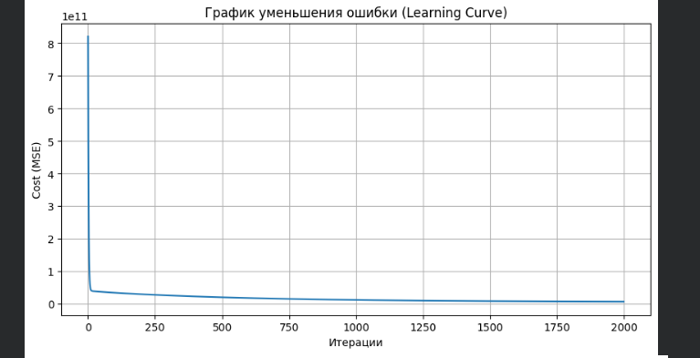
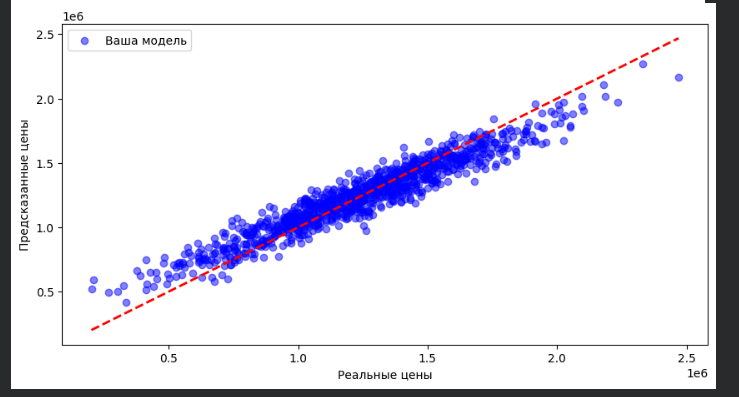

# House-Price-Prediction-ML
# House Price Prediction using Gradient Descent (Group 7)

Проект по реализации линейной регрессии "с нуля" для предсказания цен на недвижимость.

## 👥 Команда проекта:
* **Toshpo’latov Abdulhamid** — Team Lead, Documentation & Presentation.
* **Bahodirov Abdusattor** — Data Preprocessing, Cleaning & Scaling.
* **Kim Evgeniy** (Я) — Mathematical Implementation, Logic & Gradient Descent.
* **Erkinov Fazliddin** — Model Evaluation, Metrics & Visualisation.

## 📈 Результаты обучения
Ниже представлены графики, подтверждающие корректность работы нашего алгоритма:

### Кривая обучения (Loss Curve)

### Прогноз vs Реальность

## 🛠 Стек технологий
* Google Colab / Python
* NumPy (для математических вычислений)
* Pandas (для работы с данными)
* Matplotlib & Seaborn (для визуализации)
* GitHub (для совместной разработки)
